# やまがた結（ゆい） — 概要と使い方

災害時の生活情報を住民同士で共有するウェブサイトです。自治体・関係機関へのご説明用に、機能と運用をまとめています。

- **URL**: https://yui-yamagata.com
- **運営**: geoAlpine合同会社（**自治体ではありません**）
- **連絡先**: info@geoalpine.net（不具合のご連絡、掲載内容の削除依頼、自治体の方からのご相談）
- **利用**: 登録・ログイン不要。スマートフォンのブラウザだけで使えます。アプリのインストールは不要です
- **費用**: 利用者・自治体とも無料

この資料の画面写真は、**2026年8月7日時点の本番サイト**をそのまま撮影したものです。

---

## 1. このサイトの位置づけ

公式が発表できるのは「どこが指定避難所か」まで。**「今どこが開いているか」は、住民の目撃が先行します。** そこを引き受けるのがこのサイトです。

そのため、掲載内容は**すべて住民の目撃情報であり、公式情報ではありません**。この但し書きは全ページのヘッダーに常時表示し、消せない設計にしています（外部監視で表示を確認しています）。

自治体の公式サイトと取り違えられることが最大のリスクと考えており、運営者名を全ページのフッターに明示しています。

**「指定されている」と「今開いている」は別物です。** 前者は自治体が、後者は住民が持っている情報で、両方そろって初めて役に立ちます。

---

## 2. 画面と使い方

画面下部に4つのタブがあります。

### 生活情報（一覧）

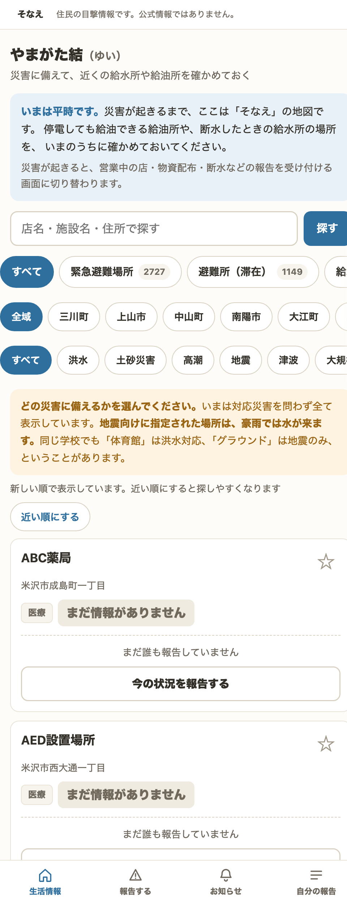

近くの施設を、種類・市町村・災害種別で絞り込んで探します。名前や住所での検索、現在地または自宅からの「近い順」表示、お気に入りの先頭固定に対応しています。

**災害種別での絞り込みは、このサイトで特に重視している機能です。** 山形県内の指定緊急避難場所2,727件のうち、洪水に対応するのは1,035件だけです。地震向けに指定された場所へ豪雨時に逃げても意味がありません。同じ学校でも「体育館は洪水対応、グラウンドは地震のみ」ということがあります。各カードに対応災害種別を必ず表示し、絞り込みもできるようにしています。

### 場所の詳細

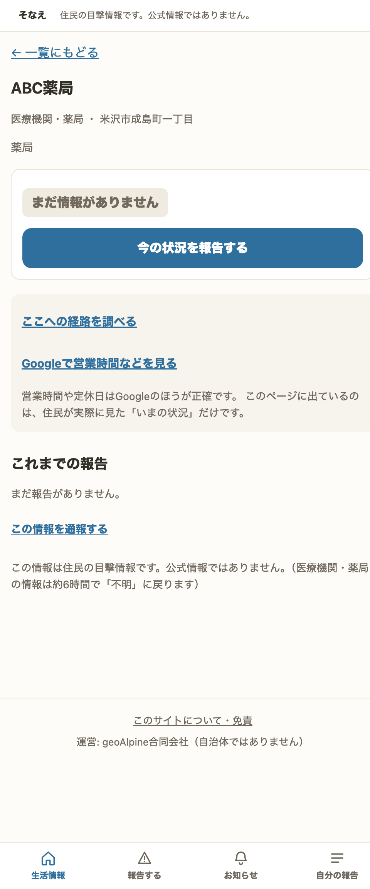

その場所の現在の状況と、これまでの報告の履歴が並びます。報告は削除せず履歴として残します。「12時は開いていた → 15時は閉まっていた」という**推移そのものが情報になる**ためです。

営業時間や定休日は検索サービスのほうが正確なので、そちらへ案内しています。このサイトが持つのは「住民が今見た状況」だけ、という線引きです。

### 報告する

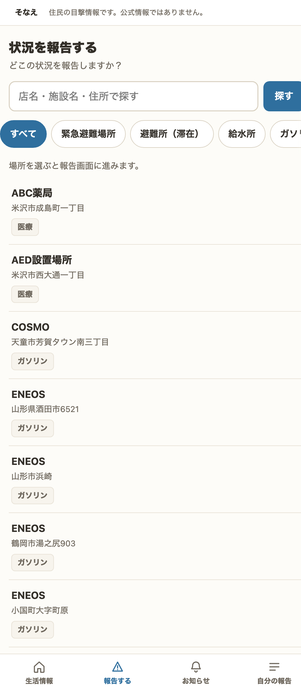

場所を選び、状況をボタンで選ぶだけです。

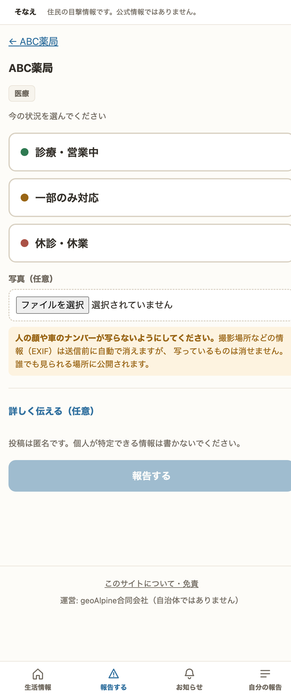

選択肢は種類ごとに用意しています（例：ガソリンスタンドなら「給油できる／数量制限あり／在庫なし／閉まっている」）。写真と補足は任意です。**平時のうちに約6,700件の場所を登録済み**なので、有事は「状況を報告する」だけで済み、ゼロから入力するより速く、位置のずれも起きません。

登録されていない場所は、住民が追加できます。

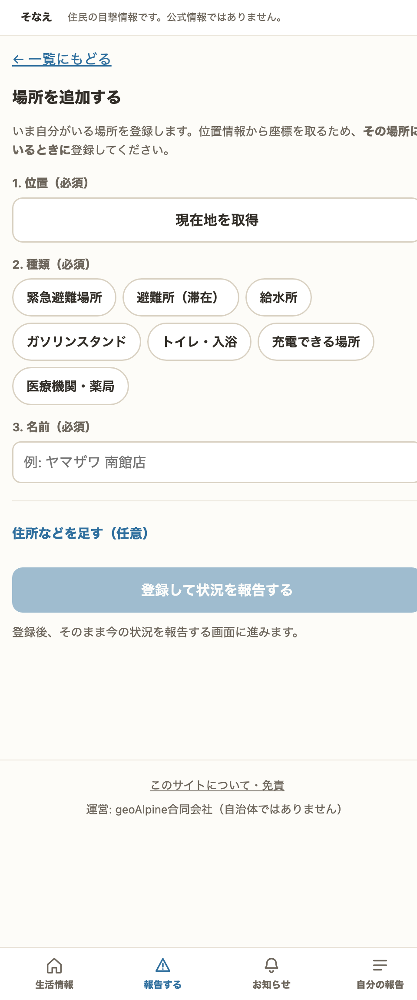

### お知らせ

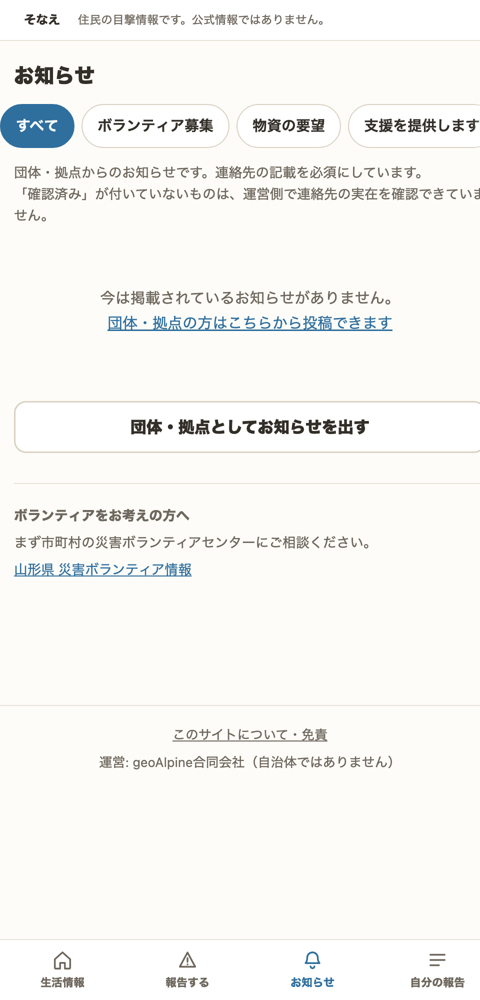

「ボランティア募集」「物資の要望」「支援を提供します」の3種類を掲示できます。

### 自分の報告

自分が出した報告の一覧と、取り消しができます。

---

## 3. 扱う情報の種類

**平時と災害時で表示を切り替えます。**

### 平時（そなえ）に表示する7種類

災害が起きる前に位置を知っておく価値があるもの、かつ**一般の検索サービスが持っていない情報**に限定しています。「今どこが開いているか」を平時に出すと、検索サービスより不正確な情報を並べることになり、かえって信頼を損なうためです。

| 種類 | 登録件数 |
|---|---|
| 緊急避難場所 | 2,727 |
| 避難所（滞在） | 1,149 |
| 医療機関・薬局 | 1,001 |
| トイレ・入浴 | 367 |
| ガソリンスタンド | 282 |
| 給水所（応急給水拠点） | 28 |
| 充電できる場所 | 8 |

### 災害時に追加される8種類

スーパー・コンビニ（794件）、ATM・現金（316件）、コインランドリー（26件）、物資配布・炊き出し、携帯・Wi-Fi、災害ごみ仮置場、断水・停電、通行止め・道路被害。

後半5種類は事前に登録できるデータ源がなく（自治体が災害時に発表するものであるため）、住民の報告と自治体からの登録に依存します。

### モードの切り替え

**山形県に特別警報が発表されるか、震度5弱以上の地震が観測されると、気象庁の発表にもとづいて自動で災害モードに切り替わります。** 自動で切り替わった場合は、その根拠を画面上部に明示します（理由が書かれないまま画面の作りが変わること自体が、不安の種になるためです）。平時への復帰は手動のみとしています。

### 災害モードの画面

> **以下4枚は訓練用の画面です。実際の被害状況ではありません。**
> 令和6年7月豪雨（2024年7月24〜27日、庄内・最上を中心に住宅被害1,379棟）を想定した訓練データを、検証環境に読み込んで撮影したものです。地名・団体名・連絡先を含め、内容はすべて架空です。画面上部の帯は検証環境である旨の表示で、本番サイトには表示されません。

平時との違いは、扱う種類が15に増えることと、住民の報告が状況として並ぶことです。

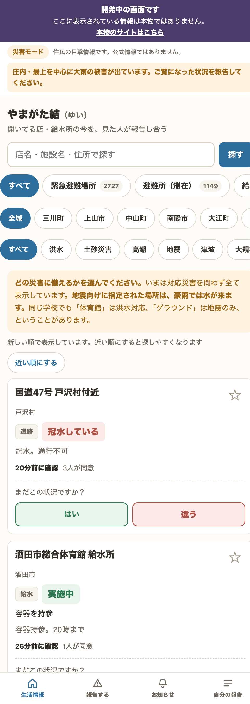

管理者からのお知らせを画面上部に帯で掲示できます。

道路の冠水は豪雨で最も効く情報で、地震では出てきません。災害の種類によって必要な情報が違うことが、この画面に表れています。

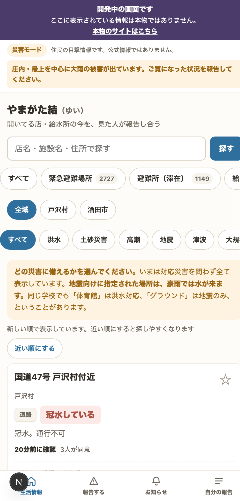

「20分前に確認」「3人が同意」のように、**いつ誰が見た情報で、何人が裏づけたか**を必ず添えます。情報が食い違った場合は警告を表示します。

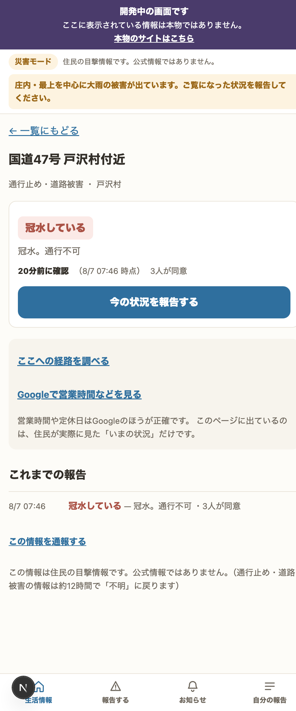

お知らせは、ボランティア募集・物資の要望・支援の提供を掲示できます。豪雨災害では床下の泥出しなど、人手が直接必要になる場面が多くあります。

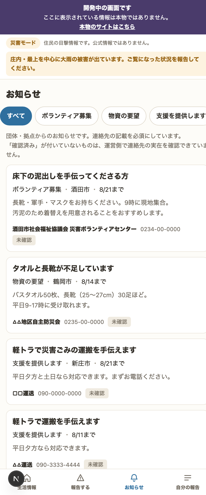

---

## 4. 情報の信頼性をどう担保しているか

誰でも投稿できる仕組みである以上、**事前審査はせず、事後の補正で精度を保つ**方針です。

### 情報に賞味期限を設ける

災害時の生活情報は数時間で腐ります。「昨日は開いていた」は無情報どころか有害です。種類ごとに期限を設け、**超えたら状態表示を「不明」に戻します。**

| 種類 | 期限 |
|---|---|
| ガソリンスタンド | 2時間 |
| 充電・携帯Wi-Fi | 4時間 |
| 店・医療・ATM・物資配布 | 6時間 |
| 避難場所・避難所・給水所・トイレ・ランドリー・道路 | 12時間 |
| 断水停電・災害ごみ仮置場 | 24時間 |

期限の1/3を超えた時点で「古い可能性あり」と表示し、再確認を促します。

判定は投稿時刻ではなく、**実際に見た時刻**を基準にします。圏外から戻って後でまとめて投稿する方がいるため、ここを混ぜると誤情報になります。

### 集合知による補正

- **追認・否認** … 「まだこの状況ですか？」に1タップで答えられます。食い違いが生じた情報には警告を表示します
- **取り消し** … 投稿者本人が自分の報告を取り下げられます
- **通報** … 「おかしい」と思った情報を誰でも通報できます
- **管理者による非表示** … 通報を確認し、個別に非表示にできます

---

## 5. 個人情報・写真の取り扱い

- **ログイン・会員登録はありません。** 氏名・メールアドレス・電話番号は一切収集しません
- 投稿者の識別には端末内で生成した匿名IDのみを使います。個人の特定はできません
- **写真は撮影場所などの情報（EXIF）を送信前に自動で削除**します
- **写真は14日で自動的に削除**します。容量対策であると同時に、写り込んだ方の顔を残し続けないための措置です
- 投稿フォームに「人の顔や車のナンバーが写らないようにしてください」「個人が特定できる情報は書かないでください」と明示しています
- 掲載内容の削除依頼は info@geoalpine.net で受け付け、窓口を全ページから辿れる場所に掲示しています

---

## 6. データの出どころ

| 情報 | 出典 |
|---|---|
| 指定緊急避難場所・指定避難所 | 国土地理院 |
| 店舗・施設の位置 | OpenStreetMap（ODbL 1.0） |
| 応急給水拠点 | 山形県公開データ |
| 住民拠点サービスステーション（自家発電付き給油所） | 資源エネルギー庁 |

OpenStreetMap の出典表示（© OpenStreetMap contributors）はライセンス上の義務であり、消えていないことを外部から自動監視しています。

**参照データは毎月1日に自動更新します。** 閉店した店が「営業中」の候補として並んだまま災害を迎えることを避けるため、更新時に元データから消えた施設は掲載を終了します。住民の報告は削除せず残します。

---

## 7. 運用体制

- **監視** … 外部（GitHub Actions）から6時間ごとに本番サイトを確認しています。サーバ内部からの監視では、サーバごと停止した場合に何も報告できないためです
- **確認内容** … 主要ページの応答、免責表示の有無、出典表示の有無。異常時は通知が飛びます
- **アクセス集中対策** … CDN（Cloudflare）を前段に配置しています
- **参照データの更新** … 毎月1日に自動実行。失敗した場合はエラーとして記録されます

---

## 8. 現時点での制約（正直な記載）

- **物資配布・災害ごみ仮置場には事前のデータ源がありません。** いずれも自治体が災害時に発表するもので、住民の報告と自治体からの登録に依存します
- **大規模アクセスへの備えは限定的です。** 熊本地震時の同種サービスは7万人／日を処理しました。同規模の集中が起きた場合、現在の構成では厳しい可能性があります
- **データベースの定期バックアップが未整備です。** サーバを失った場合、住民から寄せられた報告は復旧できません。参照データ（避難所・施設の位置）は外部データから再取得できます
- **投稿内容の事前審査は行いません。** 誤情報が一時的に掲載される可能性は残ります。上記4章の仕組みで事後に補正します

---

## 9. 他自治体での利用について

このコードは山形県専用ではありません。元にしている国土地理院・OpenStreetMap のデータは全国共通の形式で公開されているため、**都道府県コードと表示名を変更するだけで、他県でも同じものが動きます。**

災害が起きてから作り始めても間に合いません。平時に動かせる状態にしておくことに意味があると考えています。

ご相談は info@geoalpine.net までお願いします。

---

## 10. 補足資料

| | |
|---|---|
| `README.md` | 技術的な全体像、他県での利用手順 |
| `DESIGN.md` | 設計判断とその理由 |
| `docs/disaster-runbook.md` | 発災時の運用手順 |
| `/about`（サイト内） | 運営者・免責・削除依頼の窓口 |

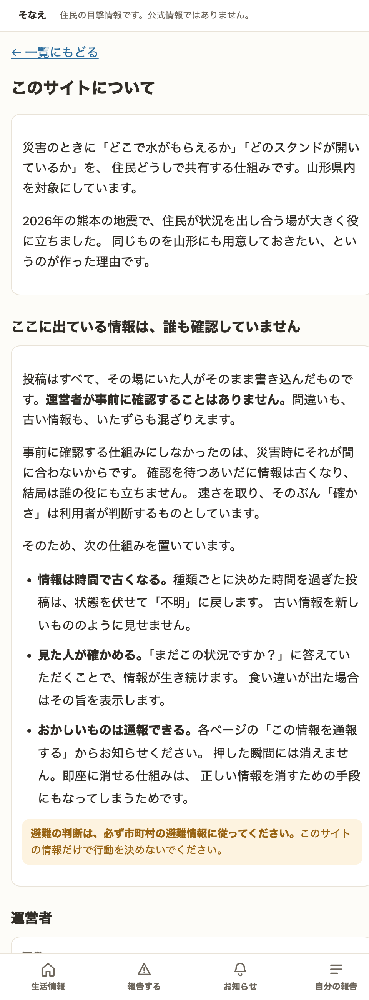
